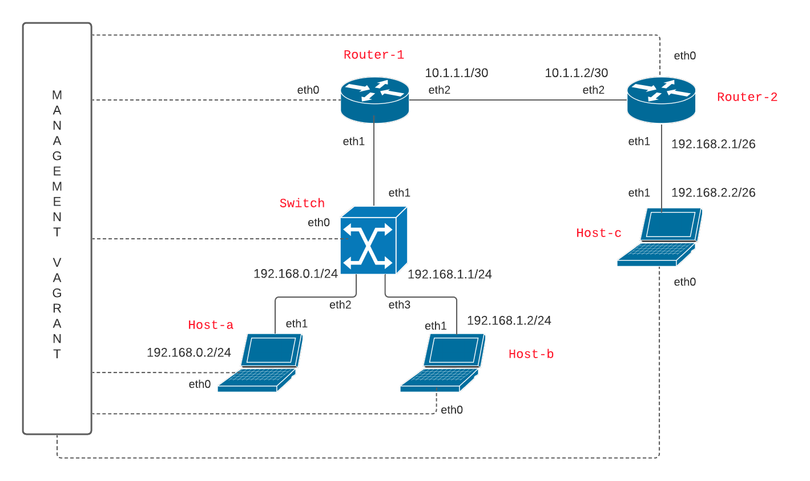

# DNCS-LAB

This repository contains the Vagrant files required to run the virtual lab environment used in the DNCS course.
```


        +-----------------------------------------------------+
        |                                                     |
        |                                                     |eth0
        +--+--+                +------------+             +------------+
        |     |                |            |             |            |
        |     |            eth0|            |eth2     eth2|            |
        |     +----------------+  router-1  +-------------+  router-2  |
        |     |                |            |             |            |
        |     |                |            |             |            |
        |  M  |                +------------+             +------------+
        |  A  |                      |eth1                       |eth1
        |  N  |                      |                           |
        |  A  |                      |                           |
        |  G  |                      |                     +-----+----+
        |  E  |                      |eth1                 |          |
        |  M  |            +-------------------+           |          |
        |  E  |        eth0|                   |           |  host-c  |
        |  N  +------------+      SWITCH       |           |          |
        |  T  |            |                   |           |          |
        |     |            +-------------------+           +----------+
        |  V  |               |eth2         |eth3                |eth0
        |  A  |               |             |                    |
        |  G  |               |             |                    |
        |  R  |               |eth1         |eth1                |
        |  A  |        +----------+     +----------+             |
        |  N  |        |          |     |          |             |
        |  T  |    eth0|          |     |          |             |
        |     +--------+  host-a  |     |  host-b  |             |
        |     |        |          |     |          |             |
        |     |        |          |     |          |             |
        ++-+--+        +----------+     +----------+             |
        | |                              |eth0                   |
        | |                              |                       |
        | +------------------------------+                       |
        |                                                        |
        |                                                        |
        +--------------------------------------------------------+


```

# Requirements
 - Python 3
 - 10GB disk storage
 - 2GB free RAM
 - Virtualbox
 - Vagrant (https://www.vagrantup.com)
 - Internet

# How-to
 - Install Virtualbox and Vagrant
 - Clone this repository
`git clone https://github.com/fabrizio-granelli/dncs-lab`
 - You should be able to launch the lab from within the cloned repo folder.
```
cd dncs-lab
[~/dncs-lab] vagrant up
```
Once you launch the vagrant script, it may take a while for the entire topology to become available.
 - Verify the status of the 4 VMs
 ```
 [dncs-lab]$ vagrant status                                                                                                                                                                
Current machine states:

router                    running (virtualbox)
switch                    running (virtualbox)
host-a                    running (virtualbox)
host-b                    running (virtualbox)
```
- Once all the VMs are running verify you can log into all of them:
`vagrant ssh router`
`vagrant ssh switch`
`vagrant ssh host-a`
`vagrant ssh host-b`
`vagrant ssh host-c`

# Assignment
This section describes the assignment, its requirements and the tasks the student has to complete.
The assignment consists in a simple piece of design work that students have to carry out to satisfy the requirements described below.
The assignment deliverable consists of a Github repository containing:
- the code necessary for the infrastructure to be replicated and instantiated
- an updated README.md file where design decisions and experimental results are illustrated
- an updated answers.yml file containing the details of your project

## Design Requirements
- Hosts 1-a and 1-b are in two subnets (*Hosts-A* and *Hosts-B*) that must be able to scale up to respectively 136 and 200 usable addresses
- Host 2-c is in a subnet (*Hub*) that needs to accommodate up to 35 usable addresses
- Host 2-c must run a docker image (dustnic82/nginx-test) which implements a web-server that must be reachable from Host-1-a and Host-1-b
- No dynamic routing can be used
- Routes must be as generic as possible
- The lab setup must be portable and executed just by launching the `vagrant up` command

## Tasks
- Fork the Github repository: https://github.com/fabrizio-granelli/dncs-lab
- Clone the repository
- Run the initiator script (dncs-init). The script generates a custom `answers.yml` file and updates the Readme.md file with specific details automatically generated by the script itself.
  This can be done just once in case the work is being carried out by a group of (<=2) engineers, using the name of the 'squad lead'. 
- Implement the design by integrating the necessary commands into the VM startup scripts (create more if necessary)
- Modify the Vagrantfile (if necessary)
- Document the design by expanding this readme file
- Fill the `answers.yml` file where required (make sure that is committed and pushed to your repository)
- Commit the changes and push to your own repository
- Notify the examiner (fabrizio.granelli@unitn.it) that work is complete specifying the Github repository, First Name, Last Name and Matriculation number. This needs to happen at least 7 days prior an exam registration date.

# Notes and References
- https://rogerdudler.github.io/git-guide/
- http://therandomsecurityguy.com/openvswitch-cheat-sheet/
- https://www.cyberciti.biz/faq/howto-linux-configuring-default-route-with-ipcommand/
- https://www.vagrantup.com/intro/getting-started/


# Design



Once the init script was executed, an 'answers.yml' file was generated which contained the details of the network to be implemented. In our case, the dcns-script assigned us 3 values corresponding to the number of scalable hosts in the subnets.

These 3 numbers are:

 - 136 for host-A
 - 200 for host-B
 - 35 for host-C

<h3><b>Subnet</b></h3>
We have decided to create 4 subnets:

- To the first subnet, the one between router-1 and router-2, we assigned the subnet 10.1.1.0/30, as we only needed to cover the two routers (2<sup>32-30</sup>-2=2).

- The second is between router-1 and host-a, in this case we used the subnet 192.168.0.0/24 to cover the 136 requested address (2<sup>32-24</sup>-2=254).

- The third subnet is between router-1 and host-b,  and to cover the 200 addresses we used the subnet 192.168.1.0/24 (2<sup>32-24</sup>-2=254).

- The last is between router-2 and host-c, here we used the subnet 192.168.2.0/26 to cover all the 35 address (2<sup>32-26</sup>-2=62).

|   Device    |    Interface	  |      IP	      |   Subnet   |
|   :-----:   |    :--------:   |   :-------:   |   :-----:  |
|   Router-1  |   enp0s9	  |   10.1.1.1	  |      1     |
|   Router-2  |   enp0s9	  |   10.1.1.2    |      1     |
|   Router-1  |  enp0s8.20	|  192.168.0.1	|      2     |
|    Host-a   |   enp0s8	  |  192.168.0.2	|      2     |
|   Router-1  |  enp0s8.30 |  192.168.1.1	|      3     |
|   Host-b    |   enp0s8   |  192.168.1.2	|      3     |
|   Router-2  |   enp0s8	  |  192.168.2.1	|      4     |
|   Host-c    |   enp0s8	  |  192.168.2.2	|      4     |

We found out that the interface format used in vagrant is different from the one used in the project delivery. To find this match, you can use one command inside each device: ```sudo dmesg | grep -i eth```

|   Device    |    Predictable interface    |      Interface	      |
|   :-----:   |    :--------:               |   :-------:   |
|   Router-1  |   enp0s9	  |   eth2	  |
|   Router-2  |   enp0s9	  |   eth2    |
|   Router-1  |  enp0s8.20	|  eth1	|
|    Host-a	  |   enp0s8	  |  eth1	|
|   Router-1	|  enp0s8.30 |  eth1	|
|   Host-b	  |   enp0s8   |  eth1	|
|   Router-2	|   enp0s8	  |  eth1	|
|   Host-c	  |   enp0s8	  |  eth1	|

Since there is a switch connecting two subnets, we decided to separate them via two different VLANs. For _subnet 2_ we used tag=20, while for _subnet 3_ we used tag=30.

#### Implementation
Whenever you start the network using the vagrant up command, the various devices auto-configure themselves by running the various shell scripts. We have created a script for each network device containing the commands to configure it.
To run the scripts automatically, you need to modify the vagrant file by replacing _common.sh_ in the ```device.vm.provision "shell" line, path: "common.sh"``` with the path to the corresponding script.

##### Main commands used
- To enable the IP forwarding of the routers we used the ```sudo sysctl -w net.ipv4.ip_forward=1```
- To add an ip address to a port of a device, we used the command ```sudo ip add add 192.168.0.2/24 dev enp0s8```
- Once an address has been assigned to a port, it must be set to up using the ```sudo ip link set dev enp0s8 up``` command
- To create a route we used the ```sudo ip route add 10.1.1.0/30 via 192.168.0.1``` command
- To create the VLANs we used the ```sudo ip link add link enp0s8 name enp0s8.20 type vlan id 20``` command
- To set up the switch by assigning the tags of the two VLANs to the ports we followed the [open vSwitch cheat sheet](https://therandomsecurityguy.com/posts/openvswitch-cheat-sheet/).
```
sudo ovs-vsctl add-br switch
sudo ovs-vsctl add-port switch enp0s8
sudo ovs-vsctl add-port switch enp0s9 tag="20"
sudo ovs-vsctl add-port switch enp0s10 tag="30"
```

As per delivery, the routes should be as generic as possible. To do this we have created a route that allows you to reach all three hosts. We used _192.168.0.0/22_ to cover all possible addresses of the 3 subnets of the hosts.

##### Host-C
The host-c must implement a web server by running a docker image. To install docker and run it from that host, we used the following commands:
```
apt-get update
apt -y install docker.io
systemctl start docker
systemctl enable docker
docker pull dustnic82/nginx-test
docker run --name nginx -p 80:80 -d dustnic82/nginx-test
```
We also needed to increase the memory of host-c from 256 to 512 (MB), otherwise it would have been impossible to pull and run the Docker image; in order to do that we modified the option ```vb.memory```.

The various hosts can connect to the web server running on the host-c using the command:  ```curl 192.168.2.2 ```
As a result, you should display a simple HTML page.

<div style="width:200px"><hr/></div>

**Alessio Belli. Matriculation number: 204913**

**Alberto Casagrande. Matriculation number: 201561**


